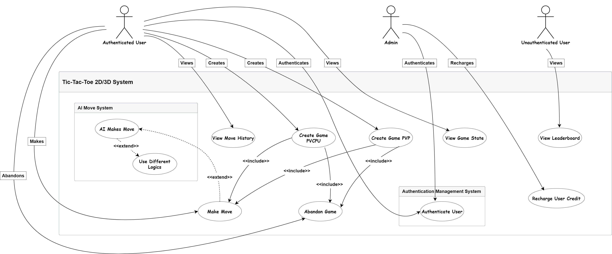
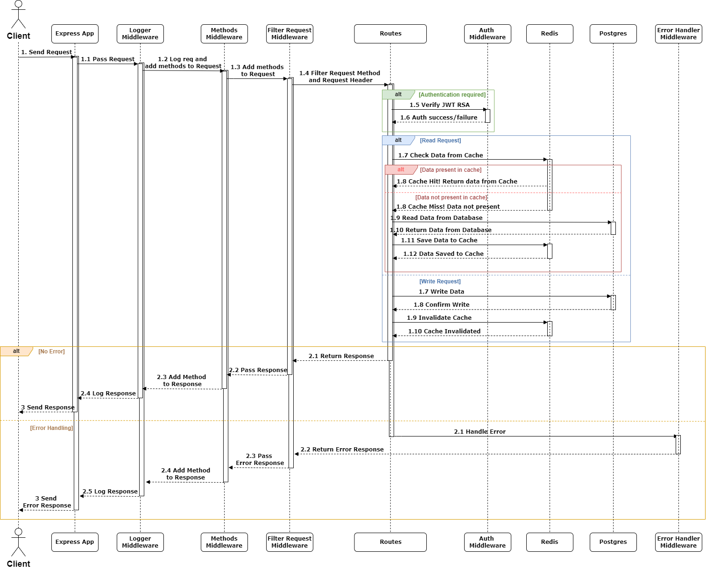
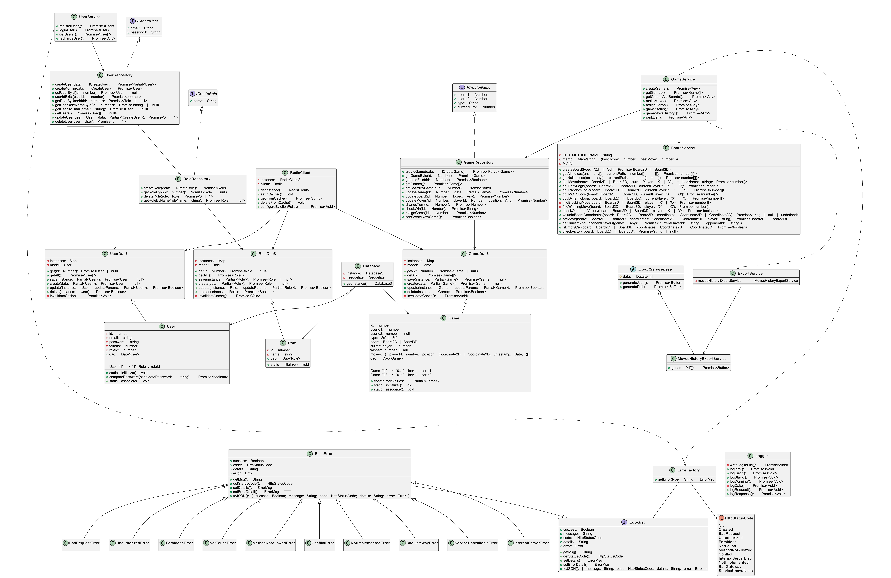

  

<p  align="center">

<a href="(https://github.com/devedale/tictactoe3d)">
  
</a>
  

</p>

  

<p  align="center">

  

<h1  align="center">TICTACTOE3D</h1>

  

</p>

  

<p  align="center">

This project is an Express.js backend build exercise for a web application that enables players to enjoy Tic-Tac-Toe in both 2D and 3D versions. It supports gameplay against other players or the CPU, with the backend handling game logic and state management.

</p>

  

<p  align="center">

  


  


  


  


  

<p>

  

<p  align="center">

  

<em align="center">Developed with the software and tools below.</em>

  

</p>

  

<p  align="center">

  


  


  


  


  


  


  

<br>

  


  


  


  


  


  

</p>

  

<hr>

  

  

## Quick Links

  
- **[Getting Started](#getting-started)**: Setup and run the TicTacToe3D application locally.
- **[Docker Compose Configuration](#docker-compose-configuration-and-service-interaction)**: Details on the Docker Compose configuration and service interactions.
- **[Dockerfile Details](#dockerfile-details)**: Information on the Dockerfiles for the app and database services.
- **[Testing with Newman](#testing-with-newman)**: Guide on how to use Newman for automated testing.
- **[Design](#design)**: Overview of the system architecture, design diagrams, and detailed design.
- **[Design Patterns Used](#design-patterns-used)**: Information on design patterns employed in the project.
- **[Project Roadmap](#project-roadmap)**: Upcoming features and improvements for the project.
- **[Contributing](#contributing)**: How to contribute to the TicTacToe3D project.
- **[License](#license)**: Licensing details for the project.
- **[Acknowledgments](#acknowledgments)**: Credits and acknowledgments for the project.`
  

---

  

  

## Objectives

  

  

<code>► This project develops a system for managing classic Tic-Tac-Toe and 3D Tic Tac Toe. It provides an interactive gaming experience, allowing authenticated users via JWT to play against each other or the computer. The system supports multiple active games simultaneously, ensuring each user participates in only one game at a time.

  

</code>

  

### Requirements translation

  
### Requirements Translation

| **Functionality**            | **Description**                                                                                                                                                                                                                   | **Endpoint**             | **HTTP Method** | **Authentication** | **Parameters**                                                                                       | **Response**                                                                                  |
|------------------------------|-----------------------------------------------------------------------------------------------------------------------------------------------------------------------------------------------------------------------------------|--------------------------|-----------------|--------------------|------------------------------------------------------------------------------------------------------|-----------------------------------------------------------------------------------------------|
| **Create New Game**          | Allows creating a new game specifying the opponent's email and game type (classic/3D). The game is charged a token fee based on if playing PvP, no charge for playing against AI. JWT auth based on user's email | `/games`                 | `POST`          | JWT                |BODY: `player2Mail`: Opponent's email to play PvP or just 'ai' to play against AI<br>`type`: Game type (2D/3D)<br>`currentPlayer`: This allows choosing if start first or start after challenger | `201 Created`: Game details<br>`400 Bad Request`: Invalid input or insufficient tokens<br>`404 Not Found`: User or game type not found |
| **Make a Move**             | Allows a player to make a move in a specified game. It checks if the move is valid and if it is the player's turn.                                                                 | `/games/:id/move`        | `POST`          | JWT                |QUERY: `x`: X-coordinate<br>`y`: Y-coordinate<br>`z`: Z-coordinate (if 3D)                                 | `200 OK`: Move details and updated board<br>`400 Bad Request`: Invalid move or parameters<br>`403 Forbidden`: Not authorized<br>`404 Not Found`: Game not found |
| **Resign from Game**         | Allows a player to resign from a specified game. The user must be authorized to resign from the game and the game should not be finished.                                   | `/games/:id/resign`      | `POST`          | JWT                | None                                                                                                 | `200 OK`: Resignation confirmed<br>`400 Bad Request`: Invalid game ID or already finished game<br>`403 Forbidden`: Not authorized to resign |
| **Get Game Status**          | Retrieves the current status of a specified game including players, current player, winner, and board state.                                                                | `/games/:id`      | `GET`           | JWT                | None                                                                                                 | `200 OK`: Game status details<br>`400 Bad Request`: Invalid game ID<br>`404 Not Found`: Game not found |
| **Get Game Move History**    | Retrieves the history of moves for a specified game. Can filter by date range and export in JSON or PDF format if requested.                                               | `/games/:id/history`       | `GET`           | JWT                |QUERY: `format`: Export format (json/pdf)<br>`startDate`: Start date<br>`endDate`: End date                  | `200 OK`: Move history<br>`400 Bad Request`: Invalid format or date range<br>`404 Not Found`: Game not found |
| **Get Rank List**            | Retrieves a ranked list of users based on their game performance including wins, losses, and win percentage.                                                                  | `/rankList`                  | `GET`           | JWT                | None                                                                                                 | `200 OK`: Rank list of users<br>`404 Not Found`: No users found |
| **Register User**            | Registers a new user with an email and password. Checks for valid email format and password length.                                                                        | `/users/register`        | `POST`          | None               | `email`: User's email<br>`password`: User's password                                                | `201 Created`: User registration complete<br>`400 Bad Request`: Invalid email or password<br>`409 Conflict`: User already exists |
| **Login User**               | Logs in a user and generates a JWT token. Verifies email and password, and returns a token for authenticated access.                                                        | `/users/login`           | `POST`          | None               | `email`: User's email<br>`password`: User's password                                                | `200 OK`: JWT token<br>`400 Bad Request`: Invalid email or password |
| **Recharge User Tokens**     | Allows an admin to refill tokens for a specific user. Admin authentication is required.                                                                                     | `/users/:id/recharge`    | `POST`          | JWT (Admin only)   | `tokens`: Amount of tokens to add                                                                     | `200 OK`: Updated user tokens<br>`400 Bad Request`: Invalid user ID or token amount<br>`403 Forbidden`: Not authorized to refill tokens |

### Other Routes

| **Functionality**            | **Description**                                                                                       | **Endpoint**     | **HTTP Method** | **Authentication** | **Parameters** | **Response**                                               |
|------------------------------|-------------------------------------------------------------------------------------------------------|------------------|-----------------|--------------------|----------------|------------------------------------------------------------|
| **Get List of Games**        | Retrieves the list of all games.                                                                      | `/games`         | `GET`           | JWT                | None           | `200 OK`: List of games<br>`404 Not Found`: No games found |
| **Get Users**                | Retrieves the list of all users.                                                                      | `/users`         | `GET`           | JWT                | None           | `200 OK`: List of users<br>`404 Not Found`: No users found |


  

  

  

## Repository Structure

  

  

```sh

  

└──  tictactoe3d/

  

├──  LICENSE

  

├──  README.md

  

├──  app

  

│  ├──  .jshintrc

  

│  ├──  .sequelizerc

  

│  ├──  Dockerfile

  

│  ├──  eslint-report.json

  

│  ├──  eslint.config.mjs

  

│  ├──  global.d.ts

  

│  ├──  migrate_seed.sh

  

│  ├──  package.json

  

│  ├──  src

  

│  │  ├──  app.ts

  

│  │  ├──  database

  

│  │  │  ├──  cache.ts

  

│  │  │  ├──  connection.ts

  

│  │  │  ├──  models

  

│  │  │  │  ├──  dao.ts

  

│  │  │  │  ├──  game.ts

  

│  │  │  │  ├──  index.js

  

│  │  │  │  ├──  role.ts

  

│  │  │  │  └──  user.ts

  

│  │  │  ├──  repository

  

│  │  │  │  ├──  game.ts

  

│  │  │  │  ├──  role.ts

  

│  │  │  │  └──  user.ts

  

│  │  │  └──  sequelize-cli

  

│  │  │  ├──  config

  

│  │  │  ├──  migrations

  

│  │  │  └──  seeders

  

│  │  ├──  errors

  

│  │  │  ├──  AppError.ts

  

│  │  │  ├──  ErrorFactory.ts

  

│  │  │  └──  HttpStatusCode.ts

  

│  │  ├──  index.ts

  

│  │  ├──  middlewares

  

│  │  │  ├──  errorHandler.ts

  

│  │  │  ├──  filterRequest.ts

  

│  │  │  ├──  jwtAuth.ts

  

│  │  │  ├──  jwtRS256.key.pub

  

│  │  │  ├──  logger.ts

  

│  │  │  └──  methods.ts

  

│  │  ├──  routes

  

│  │  │  ├──  game.ts

  

│  │  │  └──  user.ts

  

│  │  ├──  routesConfig.ts

  

│  │  └──  services

  

│  │  ├──  board.ts

  

│  │  ├──  export.ts

  

│  │  ├──  game.ts

  

│  │  ├──  jwtRS256.key

  

│  │  └──  user.ts

  

│  └──  tsconfig.json

  

├──  db

  

│  ├──  Dockerfile

  

│  └──  initdb

  

│  ├──  init.sh

  

│  └──  init.sql

  

├──  docker-compose.yml

  

└──  start.sh

  

```
# Getting Started

Welcome to the TicTacToe3D project! This guide will help you set up and run the application on your local machine. The project uses Docker for containerization, and you'll need Docker and Docker Compose to get started.

## Requirements

- **Docker**: Ensure Docker is installed and running on your machine.
- **Docker Compose**: Install Docker Compose to manage multi-container applications.

## Installation

1. **Clone the Repository**:

    ```bash
    git clone https://github.com/devedale/tictactoe3d
    cd tictactoe3d
    ```

2. **Create a `.env` File**:
    - Copy the `.env.example` file and rename it to `.env`.
    - Update the `.env` file with your specific settings. Below are some example variables you might need to configure:

    ```env
    NODE_ENV=development
    API_VERSION=/api/v1
    API_PORT=5003
    EXT_API_PORT=8003
    ADMIN_EMAIL=admin_email@email.com
    ADMIN_PASSWORD=admin_secret_password
    JWT_EXP_H=24
    MAX_LOG_FILE_SIZE=100
    DB_USER=myuser
    DB_PASSWORD=mypassword
    DB_NAME=mydatabase
    REDIS_URL=redis
    REDIS_PORT=6379
    EXPECTED_FILTER_HEADER=my_filter_header_key
    ```

3. **Run the Setup Script**:
    - The `start.sh` script is used for debugging purposes. It removes all containers, images, and volumes, sets file ownership, and starts the Docker services.
    - Make sure the script is executable:

    ```bash
    chmod +x start.sh
    ```

## Starting the Application

1. **Execute the Setup Script**:
    - Run the `start.sh` script to set up your environment and start the services:

    ```bash
    sh ./start.sh
    ```

    > **Note:** The `sh ./start.sh` script includes a command to remove existing Docker containers, images, and volumes (`docker-compose down --rmi all --volumes`). This is intended for debugging and development purposes. For production use, you should adjust or remove this command as needed.

2. **Access the Application**:
    - The application will be available at the port specified in the `.env` file (`EXT_API_PORT`).

3. **Stopping the Application**:
    - To stop and remove all containers, images, and volumes, run:

    ```bash
    docker-compose down --rmi all --volumes
    ```

## Dependencies

- **Dependencies**: The project requires several Node.js packages listed in `package.json`, including `express`, `bcrypt`, `sequelize`, `pg`, `ioredis`, and `jsonwebtoken`. Development dependencies include `typescript`, `eslint`, `prettier`, and others.

Feel free to refer to the [Docker Compose documentation](https://docs.docker.com/compose/) and the [Node.js package documentation](https://docs.npmjs.com/) for more details on the tools and libraries used in this project.

# Docker Compose Configuration and Service Interaction

This section provides an overview of the Docker Compose configuration and details on how the services interact within this project. 

### Docker Compose Overview

The `docker-compose.yml` file defines a multi-container Docker application, orchestrating services, networks, and volumes to ensure smooth operation of the application.

### Services

#### 1. **App Service**

- **Build Configuration**:
  - **Context**: `./app` - Directory containing the Dockerfile for building the application image.
  - **Dockerfile**: `Dockerfile` - Specifies the build instructions for the application container.

- **Ports**:
  - Maps the container's internal API port (`API_PORT`) to the host machine's port (`EXT_API_PORT`), allowing external access to the application.

- **Dependencies**:
  - **Depends On**: The `app` service is configured to start only when the `db` service is healthy, ensuring that the application does not attempt to connect to the database prematurely.

- **Networks**:
  - **Network1**: Connects the `app` service to the `db` service for database interactions.
  - **Network2**: Connects the `app` service to the `redis` service for caching.

- **Environment Variables**:
  - Configures various parameters including environment settings (`NODE_ENV`), API version, credentials, and Redis configuration.

- **Volumes**:
  - Maps the source code directory (`./app/src`) from the host to the container to reflect code changes without rebuilding the container.

#### 2. **Database Service (PostgreSQL)**

- **Build Configuration**:
  - **Context**: `./db` - Directory containing the Dockerfile for building the PostgreSQL image.
  - **Dockerfile**: `Dockerfile` - Specifies the build instructions for the database container.

- **Environment Variables**:
  - **POSTGRES_USER**, **POSTGRES_PASSWORD**, and **POSTGRES_DB** - Credentials and database name used by PostgreSQL.

- **Volumes**:
  - **InitDB Volume**: `./db/initdb` - Initializes the database with custom scripts.
  - **Data Volume**: `db_data` - Persists database data, ensuring data is retained across container restarts.

- **Networks**:
  - **Network1**: Connects the `db` service to the `app` service, facilitating database access.

- **Health Check**:
  - Verifies the health of PostgreSQL by executing a query to ensure the database is ready to accept connections.

#### 3. **Redis Service**

- **Image**:
  - Uses the official Redis image from Docker Hub for caching functionality.

- **Dependencies**:
  - **Depends On**: Ensures that the `redis` service starts after the `app` service is running.

- **Networks**:
  - **Network2**: Connects the `redis` service to the `app` service for caching.

### Service Interaction

1. **Application and Redis**:
   - The `app` service interacts with Redis to check for cached data before querying the database. This reduces the number of database queries and improves application performance.

2. **Application and Database**:
   - When data is not found in Redis, the `app` service queries the `db` service (PostgreSQL). This ensures that database queries are performed only when necessary, optimizing resource usage.

3. **Service Startup Order**:
   - **Health Checks**: The `app` service starts only after the `db` service is healthy. The `redis` service starts only after the `app` service is operational.
   - **Network Isolation**: The services are divided into two networks:
     - **Network1**: For communication between `app` and `db`.
     - **Network2**: For communication between `app` and `redis`.


### Dockerfile Details

#### **App Service Dockerfile**

```Dockerfile
# Use Node.js 18 base image
FROM node:18

# Set working directory
WORKDIR /usr/src/app

# Copy package.json and package-lock.json to container
COPY package*.json ./

# Install necessary dependencies for Puppeteer, including Google Chrome
RUN apt-get update \
    && apt-get install -y wget gnupg \
    && wget -q -O - https://dl-ssl.google.com/linux/linux_signing_key.pub | apt-key add - \
    && sh -c 'echo "deb [arch=amd64] http://dl.google.com/linux/chrome/deb/ stable main" >> /etc/apt/sources.list.d/google.list' \
    && apt-get update \
    && apt-get install -y google-chrome-stable fonts-ipafont-gothic fonts-wqy-zenhei fonts-thai-tlwg fonts-kacst fonts-freefont-ttf libxss1 \
       --no-install-recommends \
    && rm -rf /var/lib/apt/lists/*

# Install Node.js dependencies
RUN npm install

# Copy application source code to container
COPY . .

# Copy and set execute permissions for the database migration and seeding script
COPY migrate_seed.sh /usr/local/bin/migrate_seed.sh
RUN chmod +x /usr/local/bin/migrate_seed.sh

# Expose application port
EXPOSE 3000

# Set entrypoint to run the migration and seeding script
ENTRYPOINT ["/usr/local/bin/migrate_seed.sh"]

# Conditional command: run npm in dev mode (HOT-RELOAD with tsx watch) if NODE_ENV=development, otherwise start the app normally
CMD ["sh", "-c", "if [ \"$NODE_ENV\" = 'development' ]; then npm run dev; else npm run start; fi"]

```


#### **Database Service Dockerfile**

```Dockerfile
FROM postgres

# Installs PostGIS and PostgreSQL 13 support
RUN apt-get update && \
    apt-get install -y postgis postgresql-13-postgis-3

# Changes the UID of the 'postgres' user to 1000
RUN usermod -u 1000 postgres

# Starts the PostgreSQL server
CMD ["postgres"]
```

### Summary

This Docker Compose configuration ensures that all services (application, database, and cache) are properly managed and interact efficiently. The provided Dockerfiles detail the setup for the `app` and `db` services, enabling a smooth development workflow with optimized performance and resource management. 

- **App Service**: Includes dependencies and setup for Node.js, integrates Puppeteer with Chrome, and handles both development and production environments. It interacts with Redis to cache data and minimize database queries, improving performance. 
- **Database Service**: Configures PostgreSQL with PostGIS for spatial data and ensures proper initialization and user setup. This service is optimized for handling complex queries and data persistence. 
- **Redis Service**: Uses the official Redis image to provide caching capabilities. This service is integrated with the `app` to reduce the load on the PostgreSQL database by caching frequently accessed data.

Together, these configurations provide a well-defined service interaction strategy.


## Testing with Newman

Newman is a command-line Collection Runner for Postman. It allows you to run and test Postman collections directly from the command line, making it a powerful tool for continuous integration and automated testing in your development workflow.
#### Running Tests with Newman

To execute tests using Newman, you can use the following command:

```bash
newman run app/tictactoe3D.postman_collection.json -e app/tictactoe3D.postman_environment.json
```
```markdown #### Here's what each part of the command does: 
- **`newman run`**: Executes the specified Postman collection. 
- **`app/tictactoe3D.postman_collection.json`**: Path to the Postman collection file that contains the API requests and tests you want to run. 
- **`-e app/tictactoe3D.postman_environment.json`**: Specifies the environment file to be used during the test run. This file contains environment variables that Postman needs to run the tests accurately.
```

#### Steps for Setting Up Testing

1. **Install Newman**:
   - You need to have Newman installed. You can install it globally using npm:
     ```bash
     npm install -g newman
     ```

2. **Prepare Your Collection and Environment**:
   - Ensure that your Postman collection and environment files are correctly defined and located at the specified paths.

3. **Run Tests**:
   - Use the provided Newman command to execute your tests. Newman will process the collection and environment files, execute the API requests, and report the results.
#### Why Use Newman?

- **Automation**: Integrate into CI/CD pipelines for automated testing.
- **Consistency**: Ensure that API endpoints behave as expected across different environments.
- **Reporting**: Provides detailed test reports to help with debugging and validation.

🧪 **Testing with Newman** helps ensure that your API behaves correctly and consistently, facilitating a reliable and efficient development process.

## Design

### Overview

The design section of the TicTacToe3D project outlines the architecture, system interactions, and data structures. It provides a high-level view of the system and its components, illustrated with UML diagrams to visualize the design.

### Use Case Diagram

The use case diagram represents the interactions between users and the system. It captures the functional requirements and shows the various ways in which the system can be used by different types of users.

**Placeholder for Use Case Diagram**



### Sequence Diagrams

Sequence diagrams illustrate the order of operations and interactions between objects or components during a particular scenario. They are useful for understanding the flow of messages and data between different parts of the system.

**Placeholder for Sequence Diagrams**



### Class Diagram


The class diagram provides a static view of the system’s structure by showing the system's classes, their attributes, methods, and the relationships between them. This diagram helps in understanding how data is organized and how different classes interact with each other.

**Disclaimer:** The class diagram may contain some inaccuracies or simplifications. Its primary purpose is to provide a quick overview of the interactions and methods involved in the system, rather than an exhaustive or precise representation of every detail.

**Placeholder for Class Diagram**



### Detailed Design

#### Architecture

- **Layered Architecture**: The system is designed using a layered architecture, separating concerns into different layers:
  - **Business Logic Layer**: Contains the core logic of the application, including services and controllers.
  - **Data Access Layer**: Manages interactions with the database and data models.
  - **Database Layer**: Consists of the database management system and schema.

- **Microservices**: The system uses microservices architecture for scalability and maintainability. Services such as user management, game management, and token management are decoupled and communicate through APIs.

- **Caching**: Redis is used for caching frequently accessed data to improve performance and reduce load on the database.

#### Data Flow

1. **User Registration and Login**:
   - Users register and log in through the API.
   - The system validates user credentials and generates JWT tokens for authenticated access.
   - User information and tokens are stored securely in the database.

2. **Game Management**:
   - Users can start new games, make moves, and check game status through the game management API.
   - Game data is stored in the database, and game logic is handled by the application’s business logic layer.

3. **Token Management**:
   - Admins can recharge user tokens via the API.
   - Token updates are processed and reflected in the user’s account.

### Interaction Between Components

- **API and Database**:
  - The API layer interacts with the database to perform CRUD operations and retrieve or update data.
  - Sequelize ORM is used to manage database interactions in a structured manner.

- **API and Redis**:
  - The API layer checks Redis cache before querying the database to optimize performance.
  - Redis stores frequently accessed data, reducing the need for repeated database queries.

- **Error Handling e Logging**:
  - The error handling middleware captures and processes errors, returning appropriate responses to the API requests.
  - Custom error classes and factories are used to manage different types of errors. The Logger class degine interacion with logging activities

  
# Design Patterns Used

## Error Factory - Abstract Factory Pattern

The **Error Factory** class in the system employs the **Abstract Factory** design pattern. This pattern is used to create objects without specifying the exact class of object that will be created. Instead, it provides an interface for creating families of related or dependent objects. In this context, it abstracts the creation of different types of error instances, providing a unified way to instantiate errors based on HTTP status codes.

#### Key Concepts:

- **Abstraction**: The `ErrorFactory` class abstracts the instantiation process of various error types. It provides a common interface to create error objects without exposing the details of the instantiation logic. This helps in managing errors in a consistent manner across the application.

- **Method Implementation**: The `ErrorFactory` class includes a static method, `getError`, which uses the HTTP status code to determine which specific error class to instantiate. This method encapsulates the creation logic and ensures that the correct error type is returned based on the provided status code.

- **Builder Characteristics**: Although not a full-fledged builder pattern, the `ErrorFactory` class does exhibit some builder-like characteristics. Specifically, the `ISError` method allows for additional details and underlying errors to be included when creating an `InternalServerError`. This method sets additional properties on the error instance, somewhat akin to the builder pattern's ability to configure an object with specific details.

#### Implementation in Code:

- **ErrorFactory Class**: This class is responsible for creating instances of various error types based on the HTTP status code. It uses a switch-case statement to map status codes to their corresponding error classes. This method of instantiation ensures that the error creation logic is centralized and easy to maintain.

  ```typescript
  export class ErrorFactory {
    /**
     * Retrieves an error instance based on the provided HTTP status code type.
     *
     * @param {string} type - The HTTP status code type (as a string).
     * @returns {Errors.ErrorMsg | null} An instance of the corresponding error class, or null if the type is not recognized.
     */
    static getError(type: string): Errors.ErrorMsg | null {
      switch (HttpStatusCode[type]) {
        case HttpStatusCode.BadRequest:
          return new Errors.BadRequestError();
        case HttpStatusCode.Unauthorized:
          return new Errors.UnauthorizedError();
        case HttpStatusCode.Forbidden:
          return new Errors.ForbiddenError();
        case HttpStatusCode.NotFound:
          return new Errors.NotFoundError();
        case HttpStatusCode.MethodNotAllowed:
          return new Errors.MethodNotAllowedError();
        case HttpStatusCode.Conflict:
          return new Errors.ConflictError();
        case HttpStatusCode.InternalServerError:
          return new Errors.InternalServerError();
        case HttpStatusCode.NotImplemented:
          return new Errors.NotImplementedError();
        case HttpStatusCode.BadGateway:
          return new Errors.BadGatewayError();
        case HttpStatusCode.ServiceUnavailable:
          return new Errors.ServiceUnavailableError();
        default:
          return null;
      }
    }

    /**
     * Creates an InternalServerError with additional details and an underlying error.
     *
     * @param {string} details - A description of the additional error details.
     * @param {Error} error - The underlying error to include.
     * @returns {Errors.ErrorMsg} An instance of InternalServerError with the provided details and underlying error.
     */
    static ISError(details: string, error: Error): Errors.ErrorMsg {
      Logger.logStack(`Internal Server Error LOG: ${details}`, error);
      return new Errors.InternalServerError().setDetails(details).setErrorDetail(error);
    }
  }


## Singleton Pattern

### Overview

The Singleton pattern ensures that a class has only one instance and provides a global point of access to that instance. This pattern is used to manage shared resources such as database connections and caching mechanisms.
### Implementation in the Application
#### Redis Client
```typescript
class RedisClient {
  private static instance: RedisClient;
  private client: Redis;

  private constructor() {
    // Redis client initialization
  }

  public static getInstance(): RedisClient {
    if (!RedisClient.instance) {
      RedisClient.instance = new RedisClient();
    }
    return RedisClient.instance;
  }

  // Redis methods...
}

```
The `RedisClient` class implements the Singleton pattern to manage a single Redis connection instance throughout the application. This ensures that there is only one Redis client managing the cache, which is crucial for consistency and efficiency.

#### Sequelize Database Connection

The `Database` class follows the Singleton pattern to ensure that only one instance of the Sequelize connection is created. This avoids multiple connections to the database, reducing overhead and improving performance.

```typescript
class Database {
  private static instance: Database;
  private _sequelize: Sequelize;

  private constructor() {
    // Sequelize initialization
  }

  public static getInstance(): Database {
    if (!Database.instance) {
      Database.instance = new Database();
    }
    return Database.instance;
  }
}


```

### Data Access Object (DAO) Pattern

The **Data Access Object (DAO)** pattern is employed in this application to abstract and encapsulate all interactions with the database. By using the DAO pattern, the application achieves a clean separation between the data access logic and the business logic, promoting modularity and maintainability.

### Overview of the DAO Pattern

The DAO pattern provides a way to manage data persistence by defining an interface for accessing data and its implementation. This pattern allows you to interact with the database without exposing the underlying implementation details to the rest of the application. 

### Key Components

1. **Interface (`DaoI<T>`):**
   - Defines the methods for data access operations such as `get`, `getAll`, `save`, `create`, `update`, and `delete`.
   - Ensures that any implementation of the DAO adheres to this contract, providing a consistent API for data operations.

2. **Concrete DAO Implementation (`Dao<T>`):**
   - Implements the `DaoI<T>` interface for a specific Sequelize model.
   - Manages CRUD operations and integrates caching to enhance performance.

### How DAO Pattern is Implemented

#### 1. Interface Definition

The `DaoI<T>` interface specifies the core methods required for data access:

- `get(id: number): Promise<T | null>`: Retrieves a model instance by its primary key.
- `getAll(): Promise<T[]>`: Retrieves all instances of the model.
- `save(instance: Partial<T>): Promise<T | null>`: Saves a new instance of the model.
- `create(data: Partial<T>): Promise<T | null>`: Creates a new instance of the model.
- `update(instance: T, updateParams: Optional<T, keyof T>): Promise<boolean>`: Updates an existing instance of the model.
- `delete(instance: T): Promise<boolean>`: Deletes an existing instance of the model.

#### 2. Concrete DAO Implementation

The `Dao<T>` class implements the `DaoI<T>` interface and provides the following functionalities:

- **Singleton Pattern**: Ensures that only one instance of the DAO exists for each model, preventing unnecessary instantiation and improving performance.
  

```typescript
export class Dao<T extends Model> implements DaoI<T> {
  private static instances: Map<ModelCtor<any>, Dao<any>> = new Map();
  private model: ModelCtor<T>;

  private constructor(model: ModelCtor<T>) {
    this.model = model;
  }

  public static getInstance<T extends Model>(model: ModelCtor<T>): Dao<T> {
    if (!this.instances.has(model)) {
      this.instances.set(model, new Dao(model));
    }
    return this.instances.get(model) as Dao<T>;
  }

  // DAO methods...
}
```


## Bridge Design Pattern

The Bridge Design Pattern is employed in the web application to separate the abstraction of AI opponent logic from its implementation. This pattern helps in managing different strategies for CPU opponents by decoupling the logic from the specific implementations of the game board and move strategies.

### Overview

The Bridge Design Pattern involves creating an abstraction layer (the "bridge") that separates the high-level logic from the low-level implementation. This allows for flexibility and scalability by enabling the independent development of different logic strategies and their implementations.

### Application in the Web Application

In our web application, the `BoardService` class represents the abstraction layer, and the different AI strategies (such as `cpuEasyLogic`, `cpuRandomLogic`, `cpuMCTSLogic`, and `cpuDynamicLogic`) represent the various implementations.

#### Components

1. **Abstraction (`BoardService`)**
   - This class defines the high-level interface for managing the game board and interacting with different CPU move strategies.
   - It provides methods to create boards, execute CPU moves, and manage game logic without being tightly coupled to any specific strategy.

2. **Refined Abstractions**
   - Each method like `cpuEasyLogic`, `cpuRandomLogic`, `cpuMCTSLogic`, and `cpuDynamicLogic` is a refined abstraction that encapsulates specific AI strategies.
   - These methods implement different logic strategies while interacting with the `BoardService` to manage board states and make moves.

3. **Implementations**
   - Different AI strategies can be easily implemented or modified without altering the core functionality of `BoardService`.
   - For instance, `cpuMCTSLogic` uses Monte Carlo Tree Search, while `cpuEasyLogic` selects the first available move. Each strategy is designed independently and can be switched or extended as needed.

### Benefits

- **Separation of Concerns**: By using the Bridge Design Pattern, the game logic is kept separate from the specific AI implementations. This enhances code readability and maintainability.
- **Flexibility**: New AI strategies can be added with minimal changes to the existing codebase. This pattern allows for easy integration of new logic without disrupting the core board management.
- **Scalability**: The pattern supports the addition of more complex strategies or variations in the future without needing a complete redesign of the system.

### Example

```typescript
public async cpuMove(board: Board2D | Board3D, currentPlayer: 'X' | 'O', methodName: string = this.CPU_METHOD_NAME): Promise<number[]> {
    return this[methodName](board, currentPlayer);
}
```


## Project Roadmap

  

  

- [X] `► Backend`

  

- [ ] `► BackEnd Improvments`

  

- [ ] `► FrontEnd`


  

  

---

  

  

## Contributing

  

  

Contributions are welcome! Here are several ways you can contribute:

  

  

-  **[Submit Pull Requests](https://github.com/devedale/tictactoe3d/blob/main/CONTRIBUTING.md)**: Review open PRs, and submit your own PRs.

  

-  **[Join the Discussions](https://github.com/devedale/tictactoe3d/discussions)**: Share your insights, provide feedback, or ask questions.

  

-  **[Report Issues](https://github.com/devedale/tictactoe3d/issues)**: Submit bugs found or log feature requests for Tictactoe3d.

  

  

<details closed>

  

<summary>Contributing Guidelines</summary>

  

  

1.  **Fork the Repository**: Start by forking the project repository to your GitHub account.

  

2.  **Clone Locally**: Clone the forked repository to your local machine using a Git client.

  

```sh

  

git  clone  https://github.com/devedale/tictactoe3d

  

```

  

3.  **Create a New Branch**: Always work on a new branch, giving it a descriptive name.

  

```sh

  

git  checkout  -b  new-feature-x

  

```

  

4.  **Make Your Changes**: Develop and test your changes locally.

  

5.  **Commit Your Changes**: Commit with a clear message describing your updates.

  

```sh

  

git  commit  -m  'Implemented new feature x.'

  

```

  

6.  **Push to GitHub**: Push the changes to your forked repository.

  

```sh

  

git  push  origin  new-feature-x

  

```

  

7.  **Submit a Pull Request**: Create a PR against the original project repository. Clearly describe the changes and their motivations.

  

  

Once your PR is reviewed and approved, it will be merged into the main branch.

  

  

</details>

  

  

---

  

  

## License

  

  

For more details, refer to the [LICENSE](./LICENSE) file.

  

  

## Acknowledgments

Extending thanks to:

- **[UNIVPM](https://www.univpm.it/)**: For the educational materials and resources that contributed to the understanding and implementation of complex algorithms and system design.
- **[MDN Web Docs](https://developer.mozilla.org/)**: For the extensive documentation and tutorials on web technologies that guided the development process.
- **[Refactoring Guru](https://refactoring.guru/)**: For providing comprehensive resources and examples on design patterns and refactoring techniques that were instrumental in shaping the architecture of this project.


  

[**Return**](#-quick-links)

  

  

---
